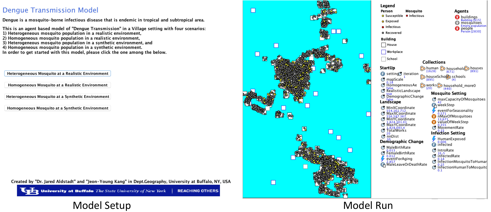

# Spatially Explicit Agent-Based Models of Dengue Virus Transmission

* Author: Jeon-Young Kang
* Contact: jeonyoung.kang.geo@gmail.com

## **Description**

Dengue is a considerable public health problem in tropical and sub-tropical area. It is transmitted primarily *Aedes* mosquitoes. There are four distinct serotype of DENV, but serologically close to each other. An infection from any single serotype of DENV provides a life-long immunity to that serotype, and a short-term cross protection to other three serotypes. 

This project provides spatially explicit agent-based models (ABMs) of Dengue Virus (DENV) transmission. In the model, individual human and infectious mosquito agents interact each other in the spatially explicit environment. A study from this project has been published in the following article:

Kang, J. Y., & Aldstadt, J. (2017). The Influence of Spatial Configuration of Residential Area and Vector Populations on Dengue Incidence Patterns in an Individual-Level Transmission Model. International journal of environmental research and public health, 14(7), 792. DOI: https://doi.org/10.3390/ijerph14070792

## **Model Objectives**

This model has been developed to test the hypothesis about the joint impacts of mosquito vector population structure and spatial configuration of residential area. 

There are four scenarios as follows:
* HeteroReal: Heterogeneous mosquito population in a realistic environment
* HomoReal: Homogeneous mosquito population in a realistic environment
* HeteroSynth: Heterogeneous mosqutio population in a synthetic environment
* HomoSynth: Homogeneous mosquito population in a synthetic environment

## **Instruction**

In order to run this model, [AnyLogic](https://www.anylogic.com/downloads/) simulation software should be installed in your local environment. 

"Personal Learning Edition (PLE)" limits creating a large number of dynamic agents (i.e., 50,000). 

Due to this limit, this project may not be properly ran through "PLE" version. 

For the proper use of this model, please purchase "University Researcher version" or try free 60-day trial. 

