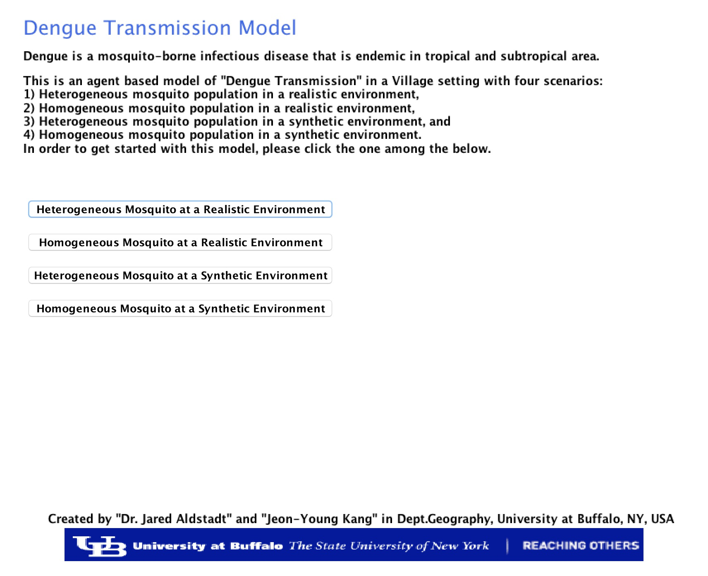

# Spatially Explicit Agent-Based Models of Dengue Virus Transmission

* Author: Jeon-Young Kang
* Contact: jeonyoung.kang.geo@gmail.com

**Description**

Dengue is a considerable public health problem in tropical and sub-tropical area. It is transmitted primarily *Aedes* mosquitoes. There are four distinct serotype of DENV, but serologically close to each other. An infection from any single serotype of DENV provides a life-long immunity to that serotype, and a short-term cross protection to other three serotypes. 

This project provides spatially explicit agent-based models (ABMs) of Dengue Virus (DENV) transmission. In the model, individual human and infectious mosquito agents interact each other in the spatially explicit environment. A study from this project has been published in the following article:

Kang, J. Y., & Aldstadt, J. (2017). The Influence of Spatial Configuration of Residential Area and Vector Populations on Dengue Incidence Patterns in an Individual-Level Transmission Model. International journal of environmental research and public health, 14(7), 792. DOI: https://doi.org/10.3390/ijerph14070792

